### Terraform Deployment Report

### Step 1: Initialization
Command: terraform init

Purpose: Initializes Terraform in the working directory.
Screenshot: 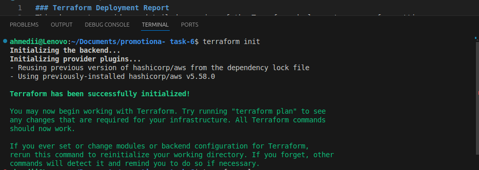
### Step 2: Configuration
Files: main.tf, variables.tf, outputs.tf

Purpose: Defines infrastructure components using Terraform configuration files.

### Step 3: Plan Generation
Command: terraform plan 

Purpose: Generates an execution plan describing what Terraform will do.
Screenshot:

### Step 4: Apply Changes
Command: terraform apply 

Purpose: Applies the execution plan to make changes to infrastructure.
Screenshot: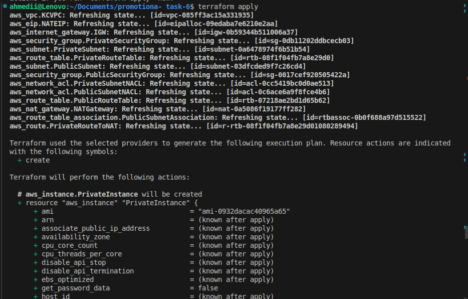

### Step 5: Destroy Resources 
Command: terraform destroy

Purpose: Destroys all resources created by Terraform.

### creating KCVPC
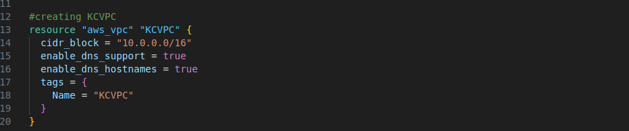

### public subnet
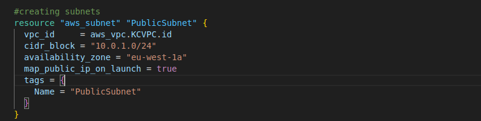

### private subnet
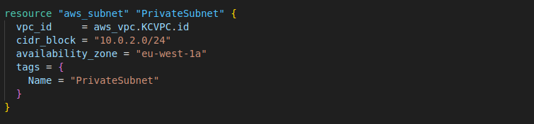

### public security group
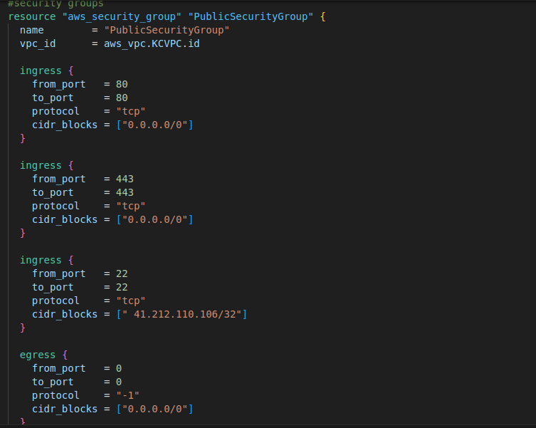

### private ssecurity group
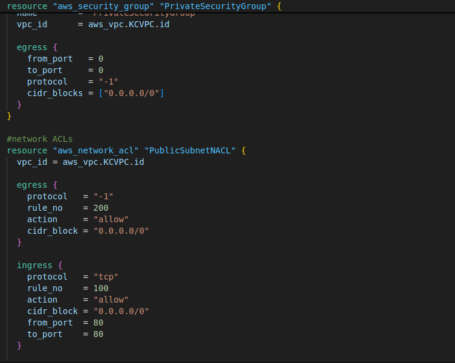

### public route table
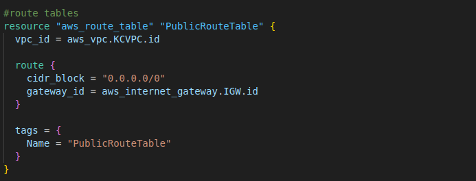

### private route table
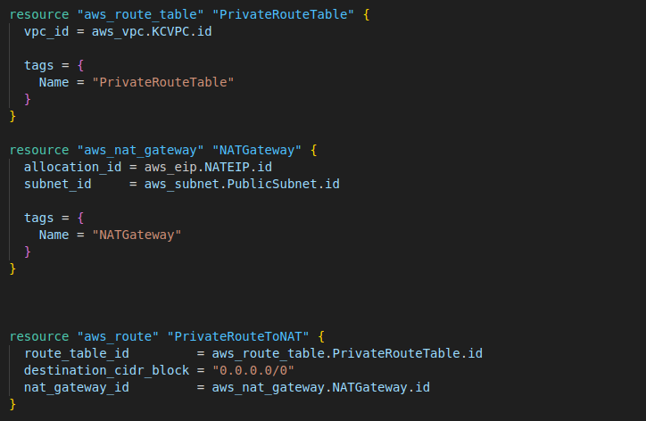

### networkACL
## with public subnet
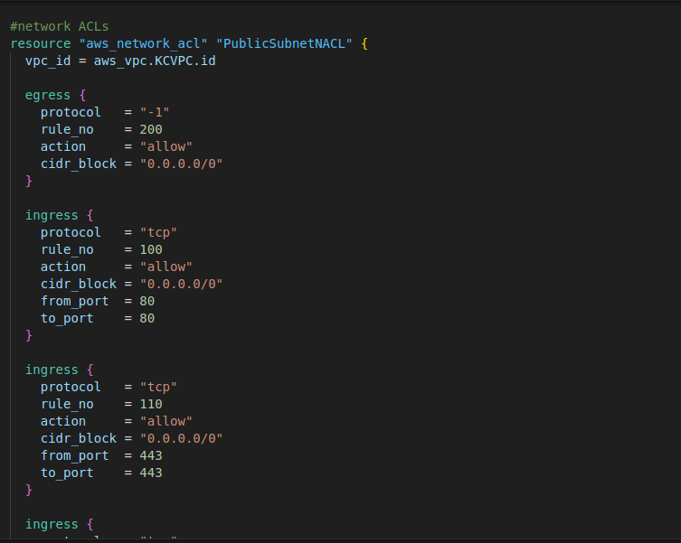
## with private subnet
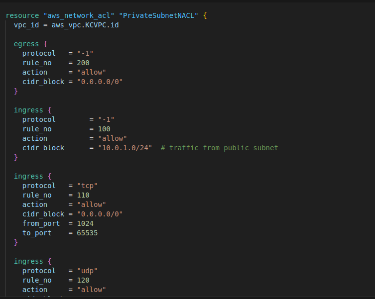
